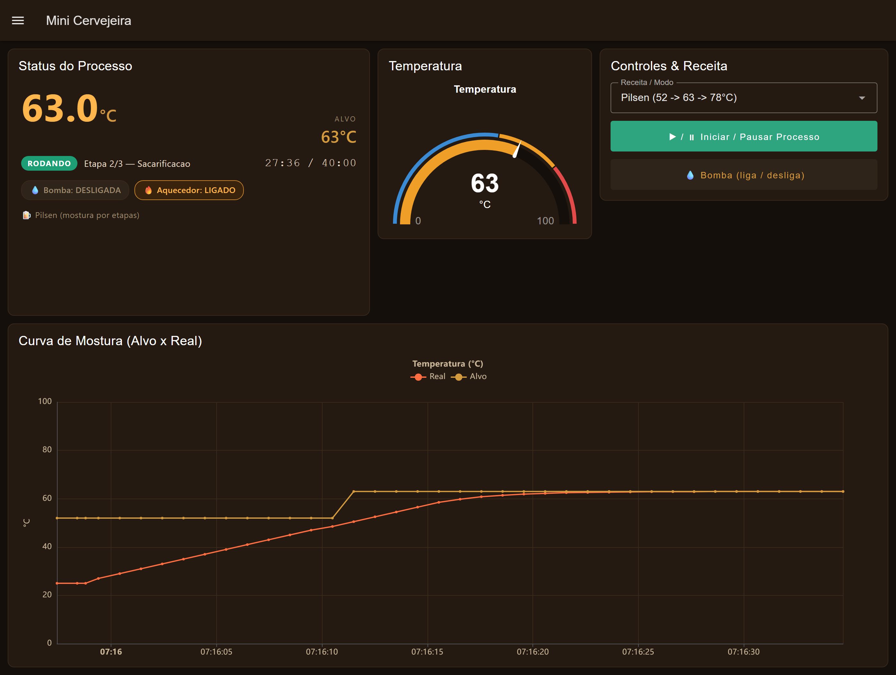
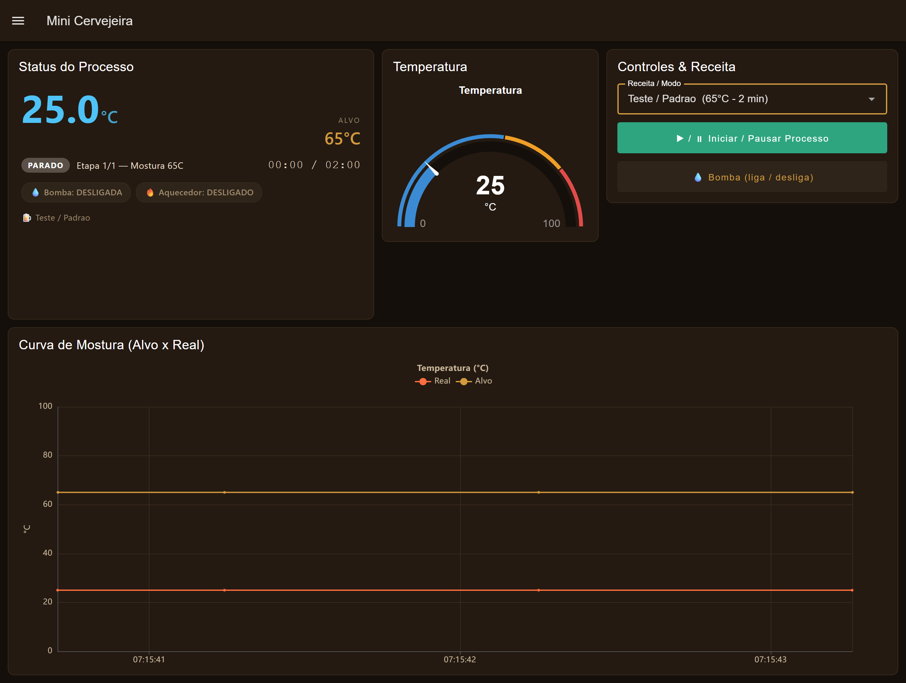
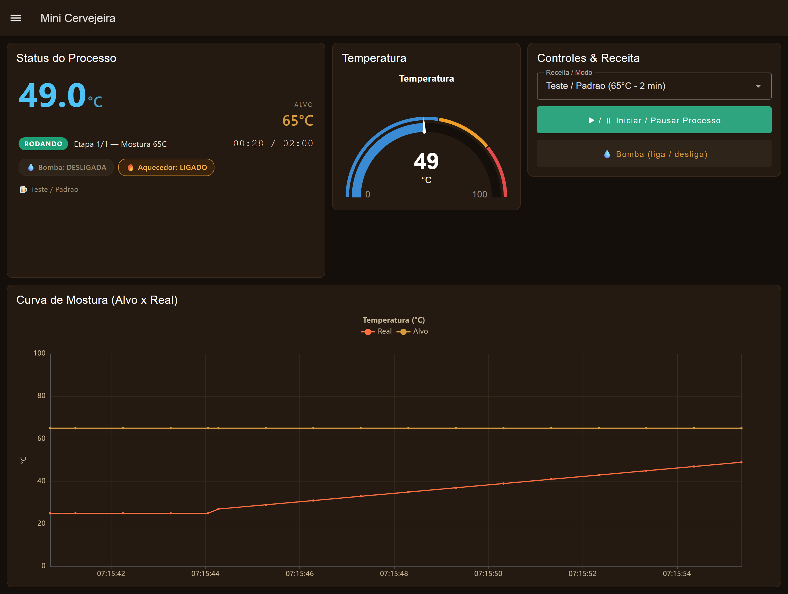

# 🍺 Mini Cervejeira — Arduino + Supervisório Node-RED

Projeto de uma **mini cervejeira** controlada por **Arduino (atuando como CLP)** e
monitorada por um **supervisório web** feito em **Node-RED + Dashboard 2.0**.

O Arduino controla aquecedor, bomba e sensor de temperatura; o supervisório mostra
temperatura, etapa do processo e a **curva de mostura (Alvo × Real)**, e envia comandos
de volta. Há um **modo de simulação** que roda o painel sem o hardware — e que fala
exatamente o mesmo protocolo do Arduino real.



## 📂 Estrutura

```
.
├── README.md                  → este arquivo
├── firmware/
│   └── mini_cervejeira_v6/
│       └── mini_cervejeira_v6.ino   → código do Arduino (CLP)
├── node-red/
│   ├── cervejeira_nodered_SIMULACAO.json → supervisório v2 (Dashboard 2.0 + simulação)
│   └── cervejeira_nodered.json           → supervisório v1 (Dashboard 1.0, legado)
└── docs/
    ├── supervisorio_inicial.png
    ├── supervisorio_teste.png
    └── supervisorio_pilsen.png
```

## ✨ O que o supervisório v2 tem

- Visual repaginado (Dashboard 2.0, tema escuro estilo cerveja).
- **Card de status**: temperatura grande, alvo, etapa, cronômetro e chips de Bomba/Aquecedor.
- **Gráfico de mostura "Alvo × Real"** — acompanha a curva de temperatura do processo.
- **Receitas / modos** selecionáveis:
  - **Teste / Padrão** (65 °C · 2 min) — *idêntico ao firmware atual do Arduino*.
  - **Pilsen** — mostura por etapas 52 → 63 → 78 °C.
  - **American Pale Ale** — 67 → 78 °C.
- Motor de simulação que reproduz a lógica do `.ino` (histerese ±0,5 °C, intertravamento
  da bomba, troca automática de etapa) e emite o **mesmo JSON** do Arduino.

| Inicial | Rodando (Teste) | Pilsen (etapas) |
|---|---|---|
|  |  |  |

## 🚀 Rodar o supervisório (simulação, sem Arduino)

Instalar uma vez:

```bash
npm install -g node-red
# na pasta do Node-RED do usuário (ex.: C:\Users\<voce>\.node-red):
npm install @flowfuse/node-red-dashboard node-red-node-serialport
```

Rodar:

1. `node-red`
2. Abra `http://localhost:1880` → menu → **Import** → cole o conteúdo de
   [`node-red/cervejeira_nodered_SIMULACAO.json`](node-red/cervejeira_nodered_SIMULACAO.json) → **Deploy**.
3. Abra o painel em **`http://localhost:1880/dashboard`**, escolha uma receita e clique
   em **Iniciar / Pausar**.

## 🔌 Ligar no Arduino real

O simulador emite **o mesmo JSON** e usa **os mesmos comandos** do firmware, então só
trocamos a fonte de dados:

1. Garanta que `node-red-node-serialport` está instalado (passo acima).
2. **Desabilite** o nó **`Clock 1s`** (clique → Disable) — para a simulação.
3. **Habilite** os nós **`Arduino -> NR`** e **`NR -> Arduino`** (Enable).
4. No nó de configuração **`Arduino`**, ajuste a **porta COM** (ex.: `COM3`) e baud **9600**.
5. **Deploy**.

> O modo **Teste / Padrão** é fiel ao firmware atual (65 °C / 2 min). As receitas
> Pilsen/APA são da simulação — o firmware atual não executa mostura por etapas. Para o
> Arduino real seguir as receitas, basta estender o `.ino` para receber os *setpoints* via
> serial (evolução futura; o painel já está preparado).

### Conferir que está funcionando (30 s)

1. No editor do Node-RED, o nó **`Arduino -> NR`** deve mostrar **"connected"** (bolinha verde).
2. A **temperatura no painel deve mudar sozinha** (o Arduino envia o estado 1×/s).
3. Clique em **Iniciar / Pausar** e veja o LED do processo / aquecedor responder no hardware.
4. Se não vier nada: confira a **porta COM** (Gerenciador de Dispositivos), se o **baud é 9600**
   e se a **IDE do Arduino não está com o Serial Monitor aberto** (ele prende a porta).

## 📡 Protocolo serial (Arduino ⇄ Node-RED · 9600 baud)

- **Arduino → NR** (1×/s): `{"temp":65.0,"proc":1,"rodando":1,"bomba":0,"aquec":1,"dec":12345}`
- **NR → Arduino**: caractere `P` (inicia/pausa processo) ou `B` (liga/desliga bomba, só com processo parado)

## 🔧 Hardware (resumo do firmware)

| Pino | Função |
|---|---|
| 2 | Botão Bomba |
| 3 | Botão Processo |
| 5 | Relé Aquecedor |
| 6 | Relé Bomba (LOW = ligado) |
| 12 | Sensor DS18B20 |
| I²C (0x27) | LCD 20×4 |
